# Jolly Roger

<picture>
  <source media="(prefers-color-scheme: dark)" srcset="screenshots/puzzle-list-dark.png">
  <source media="(prefers-color-scheme: light)" srcset="screenshots/puzzle-list-light.png">
  
</picture>

Jolly Roger is a coordination tool for collaboratively solving puzzlehunts like the [MIT Mystery Hunt](http://web.mit.edu/puzzle/www/).
The team Death and Mayhem created Jolly Roger in 2015 for the 2016 MIT
Mystery Hunt, and it is still actively maintained and in production service.

At its core, it allows tracking puzzles and guesses in an ever-evolving hunt
structure, and provides a chat room and a Google spreadsheet for each
puzzle.

Want to help develop Jolly Roger? Join our Discord server

## At a glance

- **Google Sheets** — auto-created and shared per puzzle
- **Chat** — persistent, rich-text, with @-mentions and image uploads
- **Audio calls** — built-in WebRTC via mediasoup
- **Tags** — flexible grouping, nesting, and meta-puzzle tracking
- **Activity signals** — viewer counts and sparklines
- **Search** — instant filter by title, answer, or tag
- **Notifications** — dingword mentions and bookmark state changes
- **Operator queue** — moderated guess submission to Hunt HQ
- **Discord** — role sync, invite management, bot announcements
- **And more** — bookmarks, announcements, multi-answer puzzles, dark mode, i18n, mobile

<!-- To update this video, re-run scripts/generate_screenshots.mts and follow the instructions it prints. -->
[Watch the demo video](https://github.com/user-attachments/assets/d157a122-812a-4038-80ad-0f04b40405a1)

## Features

- [Collaboration](#collaboration) — spreadsheets, chat, calls
- [Organization](#organization) — tags, search, activity tracking
- [Coordination](#coordination) — guess queue, announcements, notifications
- [Integrations & polish](#integrations--polish) — Discord, mobile, dark mode, i18n

### Collaboration

#### Automated spreadsheet creation/sharing

Like many Hunt collaboration tools, Jolly Roger automatically creates a
Google Sheet for each puzzle entered into a hunt. If a user has linked
their Google account to Jolly Roger, Jolly Roger will additionally share the
sheet with that user on first load, which will cause the user's cursor to
show their name, rather than "Anonymous Animal".

Users who do not link a Google account (or don't have or use one) can still
participate in the sheet anonymously.

See the puzzle page

 

<picture>
  <source media="(prefers-color-scheme: dark)" srcset="screenshots/puzzle-page-dark.png">
  <source media="(prefers-color-scheme: light)" srcset="screenshots/puzzle-page-light.png">
  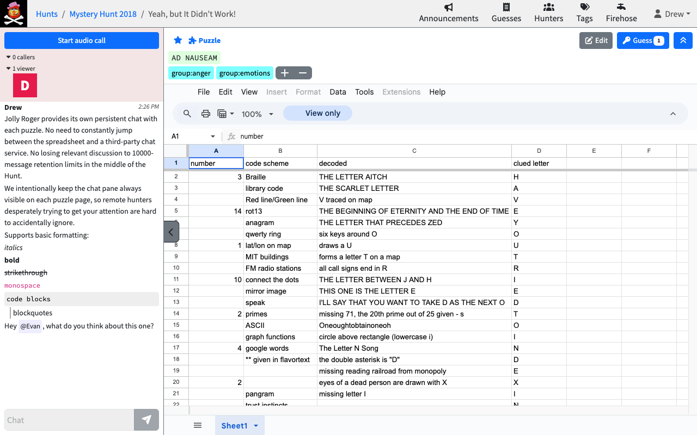
</picture>

#### Per-puzzle chat rooms

Jolly Roger provides its own persistent chat with each puzzle. No need to
constantly jump between the spreadsheet and a third-party chat service. No
losing relevant discussion from last year to a paid service's retention limits.

Chat supports rich text editing, including bulleted lists, \_italics\_,
\*bold\*, \`monospace\`, \`\`\`code blocks\`\`\`, and @-mentions with formatting
previews. You can also upload images directly into chat.

We work hard to make sure that puzzle chat is visible whenever it is active, so
remote hunters desperately trying to get your attention are hard to ignore.
While it is possible to temporarily hide it, it always pops out on new messages.

See the chat

 

<a href="screenshots/chat-light.mp4">
  <picture>
    <source media="(prefers-color-scheme: dark)" srcset="screenshots/chat-dark.gif">
    <source media="(prefers-color-scheme: light)" srcset="screenshots/chat-light.gif">
    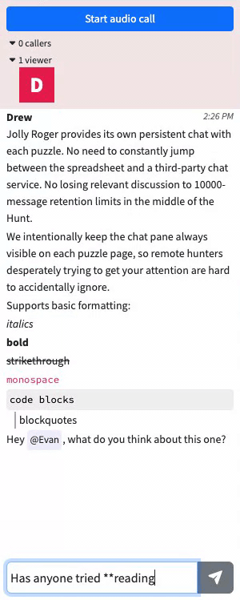
  </picture>
</a>

#### Audio calls

Each puzzle has a built-in audio call room powered by WebRTC via mediasoup.
Hunters can jump on a call without leaving the puzzle page, making real-time
collaboration seamless.

See an audio call

 

<a href="screenshots/audio-call-light.mp4">
  <picture>
    <source media="(prefers-color-scheme: dark)" srcset="screenshots/audio-call-dark.gif">
    <source media="(prefers-color-scheme: light)" srcset="screenshots/audio-call-light.gif">
    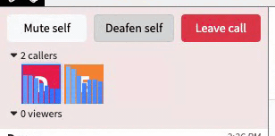
  </picture>
</a>

### Organization

#### Tag-based structure

In many hunts, it's not always clear from the beginning what puzzles will be
related or may contribute to which metapuzzles. Jolly Roger solves this by
eschewing a top-down hierarchical round structure and instead allowing
multiple tags to be applied to each puzzle to construct dynamic groupings as
you gain more information about the hunt structure over time.

Groups are automatically detected for any tag starting with `group:`. The
metapuzzle for a group is automatically recognized by having an additional
`meta-for:` tag matching the group tag. Groups can nest intelligently, and
search handles nested groups sensibly. And since early evaluations of a hunt's
structure often don't hold up as you get deeper into it, we also include
powerful tag management tools for re-grouping and re-organizing puzzles later
on.

We've found this approach able to be capable of modeling every hunt
structure we've thrown at it.

See the puzzle list

 

<picture>
  <source media="(prefers-color-scheme: dark)" srcset="screenshots/puzzle-list-dark.png">
  <source media="(prefers-color-scheme: light)" srcset="screenshots/puzzle-list-light.png">
  
</picture>

Once a metapuzzle is solved, the puzzles in that group are usually less
interesting from a hunt-progress perspective, so we automatically reorder
things on the puzzle list page, sending the whole group to the bottom of the
list when you solve the meta for the group.

Hover over any tag to see other puzzles that share that tag. This is
particularly useful for metas where you want to see the answers that feed into
the meta, or for backsolving to see what constraints all answers in that group
appear to satisfy.

See tag hover

 

<picture>
  <source media="(prefers-color-scheme: dark)" srcset="screenshots/tag-hover-dark.png">
  <source media="(prefers-color-scheme: light)" srcset="screenshots/tag-hover-light.png">
  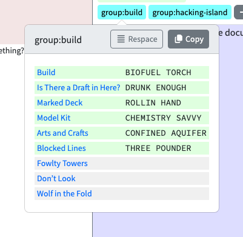
</picture>

#### Finding puzzles to work on

Several features help you discover which puzzles need attention. Viewer counts
in the puzzle list show how many hunters are currently looking at each puzzle.
Activity sparklines show recent chat, call, and document activity per puzzle at
a glance. You can also bookmark puzzles you're interested in to quickly find
them later.

See activity sparklines

 

<picture>
  <source media="(prefers-color-scheme: dark)" srcset="screenshots/activity-sparkline-dark.png">
  <source media="(prefers-color-scheme: light)" srcset="screenshots/activity-sparkline-light.png">
  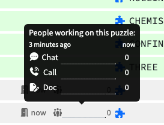
</picture>

#### Instant filter search

Find puzzles in the growing list by searching for any piece of the title,
answer, or tag.

See filter search

 

<a href="screenshots/filter-search-light.mp4">
  <picture>
    <source media="(prefers-color-scheme: dark)" srcset="screenshots/filter-search-dark.gif">
    <source media="(prefers-color-scheme: light)" srcset="screenshots/filter-search-light.gif">
    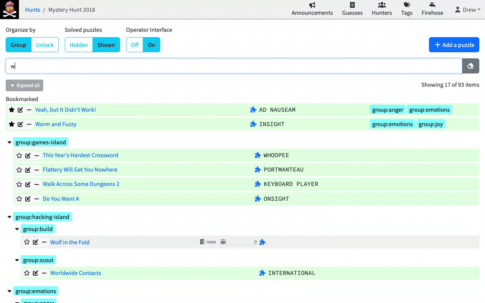
  </picture>
</a>

### Coordination

#### Notifications

Set dingwords — keywords that trigger a notification when mentioned in any chat
message across the hunt. Bookmark puzzles to receive notifications when their
state changes (e.g. when an answer is found).

See a dingword notification

 

<picture>
  <source media="(prefers-color-scheme: dark)" srcset="screenshots/dingword-dark.png">
  <source media="(prefers-color-scheme: light)" srcset="screenshots/dingword-light.png">
  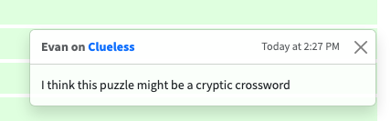
</picture>

#### Operator guess queue

Avoid irritating Hunt HQ with your team's excessive ill-fated backsolving
attempts by staffing an operator queue that can tell people "I'm not calling
this in until you convince me you're not just submitting every possible
combination of three letters."

See guess submission

 

<picture>
  <source media="(prefers-color-scheme: dark)" srcset="screenshots/guess-submission-dark.png">
  <source media="(prefers-color-scheme: light)" srcset="screenshots/guess-submission-light.png">
  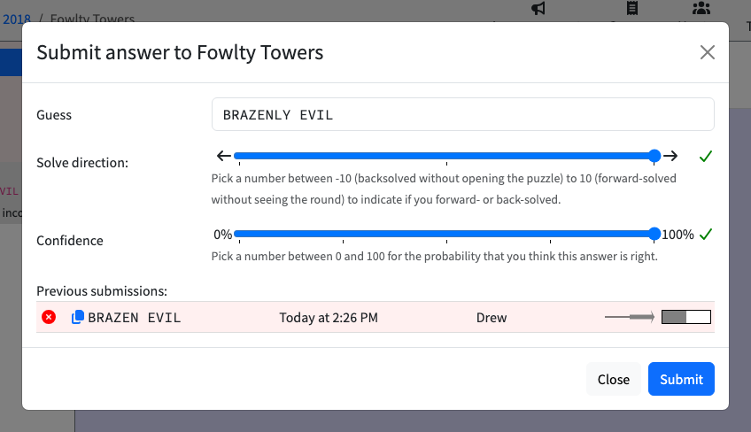
</picture>

Or just make sure your team is ready to receive callbacks before calling things
in. Operators get a notification (which appears on all pages), and anyone can
review a detailed history of guess submissions.

See the guess queue

 

<picture>
  <source media="(prefers-color-scheme: dark)" srcset="screenshots/guess-queue-dark.png">
  <source media="(prefers-color-scheme: light)" srcset="screenshots/guess-queue-light.png">
  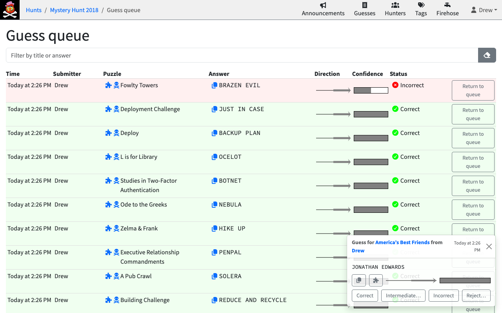
</picture>

If you don't like the overhead of tracking and requiring operator submission,
you can turn it off and let people mark their own answers as correct or not.

#### Multiple answer support

Some hunts have puzzles with multiple answers, which present a challenge for
many systems: how do you track a correct answer while still indicating that
there's more to be figured out? If you make a separate puzzle for each
answer, you lose the context of the discussion/spreadsheet; if you just
comma-separate answers, it's hard to tell which puzzles are finished vs.
ones that are only partially completed.

Jolly Roger has first-class support for puzzles with more than one answer,
and it Just Works™ with all the smart sorting too.

#### Announcements

Make sure everyone on the team sees teamwide announcements, whether they've
been actively hunting the whole time or are dropping in and out and just
need to get up to speed.

See announcements

 

<picture>
  <source media="(prefers-color-scheme: dark)" srcset="screenshots/announcements-dark.png">
  <source media="(prefers-color-scheme: light)" srcset="screenshots/announcements-light.png">
  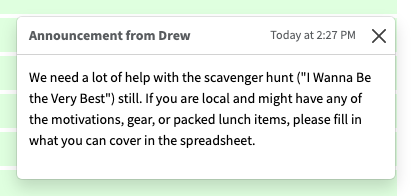
</picture>

### Integrations & polish

#### Discord integration

Jolly Roger integrates with Discord for server invite management, per-hunt role
assignment (for access to hunt-specific private channels), and bot announcements
of puzzle state changes in Discord channels. Jolly Roger also uses users'
Discord avatars within the application.

#### Mobile support

Jolly Roger is usable on mobile devices, handy for runarounds and on-the-go
coordination.

See the mobile view

 

<picture>
  <source media="(prefers-color-scheme: dark)" srcset="screenshots/mobile-dark.png">
  <source media="(prefers-color-scheme: light)" srcset="screenshots/mobile-light.png">
  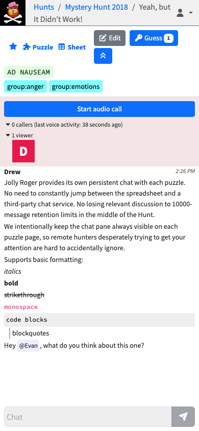
</picture>

#### Dark mode

Supports dark, light, and auto (system-following) color schemes. (If your system
is set to dark mode, you've been looking at dark-mode screenshots this whole
time!)

#### Internationalization

Available in English and Chinese.

See Chinese localization

 

<picture>
  <source media="(prefers-color-scheme: dark)" srcset="screenshots/i18n-dark.png">
  <source media="(prefers-color-scheme: light)" srcset="screenshots/i18n-light.png">
  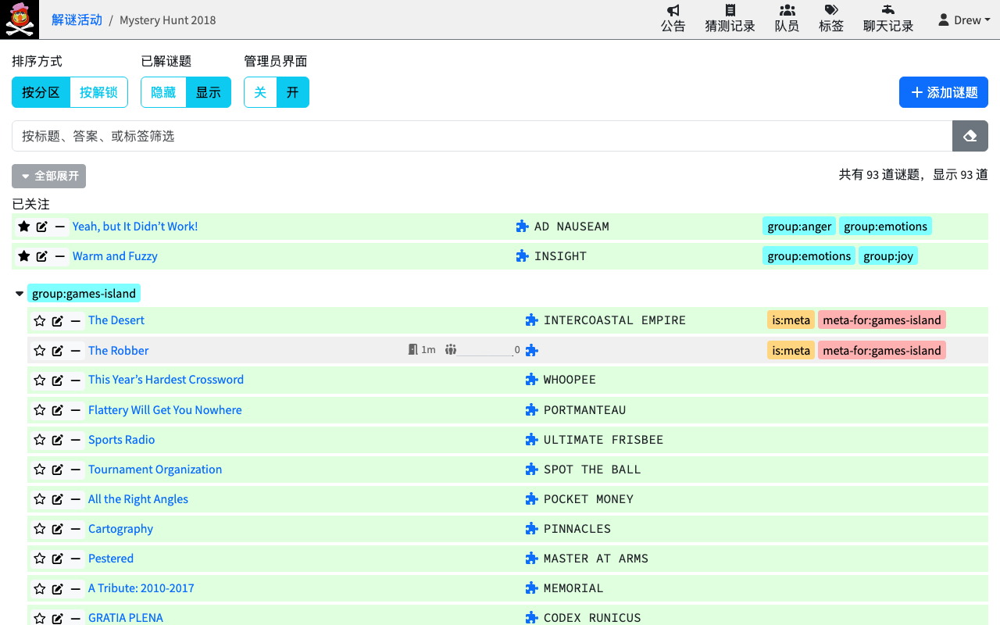
</picture>

#### Realtime updates

You never need to refresh the page. Everything tracked in Jolly Roger
updates in realtime. It's delightful.

## Setting up a Jolly Roger instance

Interested in developing or testing Jolly Roger locally? See
[DEVELOPMENT.md](DEVELOPMENT.md). Looking to run a production instance? See
[DEPLOYMENT.md](DEPLOYMENT.md).
