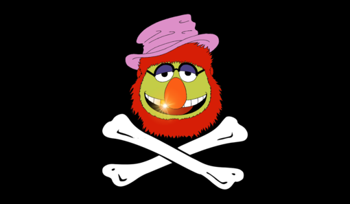

# Jolly Roger

Jolly Roger is a coordination tool for collaboratively solving puzzlehunts like the [MIT Mystery Hunt][http://web.mit.edu/puzzle/www/].
The team Death and Mayhem created Jolly Roger in 2015 for the 2016 MIT
Mystery Hunt, and it is still actively maintained and in production service.

At its core, it allows tracking puzzles and guesses in an ever-evolving hunt
structure, and provides a chat room and a Google spreadsheet for each
puzzle.

## Features

### Automated spreadsheet creation/sharing

Like many Hunt collaboration tools, Jolly Roger automatically creates a
Google Sheet for each puzzle entered into a hunt.  If a user has linked
their Google account to Jolly Roger, Jolly Roger will additionally share the
sheet with that user on first load, which will cause the user's cursor to
show their name, rather than "Anonymous Animal".

Users who do not link a Google account (or don't have or use one) can still
participate in the sheet anonymously.

### Per-puzzle chat rooms

Jolly Roger provides its own persistent chat with each puzzle.  No need to
constantly jump between the spreadsheet and a third-party chat service.  No
losing relevant discussion to 10000-message retention limits in the middle
of the Hunt.  Supports basic formatting -- bulleted lists, \_italics\_,
\*bold\*, \`monospace\`, and \`\`\`code blocks\`\`\`.

We intentionally keep the chat pane always visible on each puzzle page, so
remote hunters desperately trying to get your attention are hard to
accidentally ignore.

### Tag-based structure

In many hunts, it's not always clear from the beginning what puzzles will be
related or may contribute to which metapuzzles.  Jolly Roger solves this by
eschewing a top-down hierarchical round structure and instead allowing
multiple tags to be applied to each puzzle to construct dynamic groupings as
you gain more information about the hunt structure over time.

We've found this approach able to be capable of modeling every hunt
structure we've thrown at it.

Once a metapuzzle is solved, the puzzles in that group are usually less
interesting from a hunt-progress perspective, so we automatically reorder
things on the puzzle list page, sending the whole group to the bottom of the
list when you solve the meta for the group.

### Viewer tracking

Sometimes you want to find a puzzle that doesn't have much attention on it
right now, or you want to find something where people are already looking at
the puzzle.  Viewer counts in the puzzle list make it easy to find what
you're looking for.

### Instant filter search

Find puzzles in the growing list by searching for any piece of the title,
answer, or tag.

### Operator guess queue

Avoid irritating Hunt HQ with your team's excessive ill-fated backsolving
attempts by staffing an operator queue that can tell people "I'm not calling
this in until you convince me you're not just submitting every possible
combination of three letters."

Or just make sure your team is ready to receive callbacks before calling
things in.

### Multiple answer support

Some hunts have puzzles with multiple answers, which present a challenge for
many systems: how do you track a correct answer while still indicating that
there's more to be figured out?  If you make a separate puzzle for each
answer, you lose the context of the discussion/spreadsheet; if you just
comma-separate answers, it's hard to tell which puzzles are finished vs.
ones that are only partially completed.

Jolly Roger has first-class support for puzzles with more than one answer,
and it Just Works™ with all the smart sorting too.

### Announcements

Make sure everyone on the team sees teamwide announcements, whether they've
been actively hunting the whole time or are dropping in and out and just
need to get up to speed.

### Realtime updates

You never need to refresh the page.  Everything tracked in Jolly Roger
updates in realtime.  It's delightful.

## Setting up a Jolly Roger instance

Interested in developing or testing Jolly Roger locally?  See
[DEVELOPMENT.md](DEVELOPMENT.md).

Interested in operating a production-grade instance of Jolly Roger?  See
[OPERATION.md](OPERATION.md).
